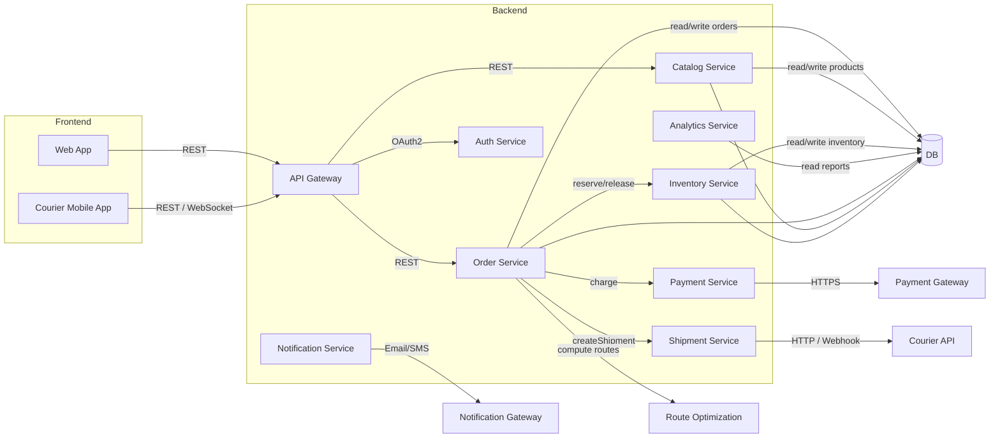

```mermaid
flowchart LR

%%  FRONTEND PACKAGE 
subgraph Frontend
    WebApp["Web App"]
    CourierApp["Courier Mobile App"]
end

%%  BACKEND PACKAGE 
subgraph Backend
    APIGW["API Gateway"]
    OrderService["Order Service"]
    CatalogService["Catalog Service"]
    PaymentService["Payment Service"]
    ShipmentService["Shipment Service"]
    InventoryService["Inventory Service"]
    NotificationService["Notification Service"]
    AnalyticsService["Analytics Service"]
    AuthService["Auth Service"]
end

%% DATABASE & EXTERNAL 
DB[(DB)]
RouteOpt["Route Optimization"]
CourierAPI["Courier API"]
PaymentGateway["Payment Gateway"]
NotificationGateway["Notification Gateway"]

%%  FRONTEND CONNECTIONS 
WebApp -->|REST| APIGW
CourierApp -->|REST / WebSocket| APIGW

%% API GATEWAY CONNECTIONS 
APIGW -->|REST| OrderService
APIGW -->|REST| CatalogService
APIGW -->|OAuth2| AuthService

%% ORDER SERVICE CONNECTIONS
OrderService -->|reserve/release| InventoryService
OrderService -->|charge| PaymentService
OrderService -->|createShipment| ShipmentService
OrderService -->|read/write orders| DB
OrderService -->|compute routes| RouteOpt

%% OTHER BACKEND SERVICES 
CatalogService -->|read/write products| DB
InventoryService -->|read/write inventory| DB
AnalyticsService -->|read reports| DB

%% EXTERNAL INTEGRATIONS 
ShipmentService -->|HTTP / Webhook| CourierAPI
PaymentService -->|HTTPS| PaymentGateway
NotificationService -->|Email/SMS| NotificationGateway

%% DB extra links 
OrderService --> DB
CatalogService --> DB
InventoryService --> DB
```
