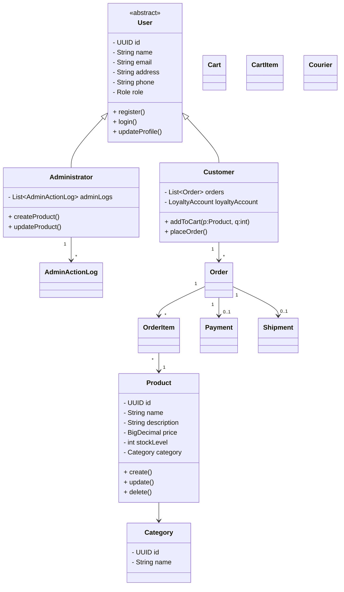

```mermaid
classDiagram
    %% SERS PACKAGE 
    class User {
        <<abstract>>
        - UUID id
        - String name
        - String email
        - String address
        - String phone
        - Role role
        + register()
        + login()
        + updateProfile()
    }

    class Customer {
        - List~Order~ orders
        - LoyaltyAccount loyaltyAccount
        + addToCart(p:Product, q:int)
        + placeOrder()
    }

    class Administrator {
        - List~AdminActionLog~ adminLogs
        + createProduct()
        + updateProduct()
    }

    User <|-- Customer
    User <|-- Administrator

    Administrator "1" --> "*" AdminActionLog


    %% ==== CATALOG PACKAGE ====
    class Product {
        - UUID id
        - String name
        - String description
        - BigDecimal price
        - int stockLevel
        - Category category
        + create()
        + update()
        + delete()
    }

    class Category {
        - UUID id
        - String name
    }

    Product --> Category


    %% ORDERING PACKAGE 
    class Cart
    class CartItem
    class Order
    class OrderItem

    Customer "1" --> "*" Order
    Order "1" --> "*" OrderItem
    OrderItem "*" --> "1" Product


    %% PAYMENT & SHIPPING PACKAGE 
    class Payment
    class Shipment
    class Courier

    Order "1" --> "0..1" Shipment
    Order "1" --> "0..1" Payment
```

